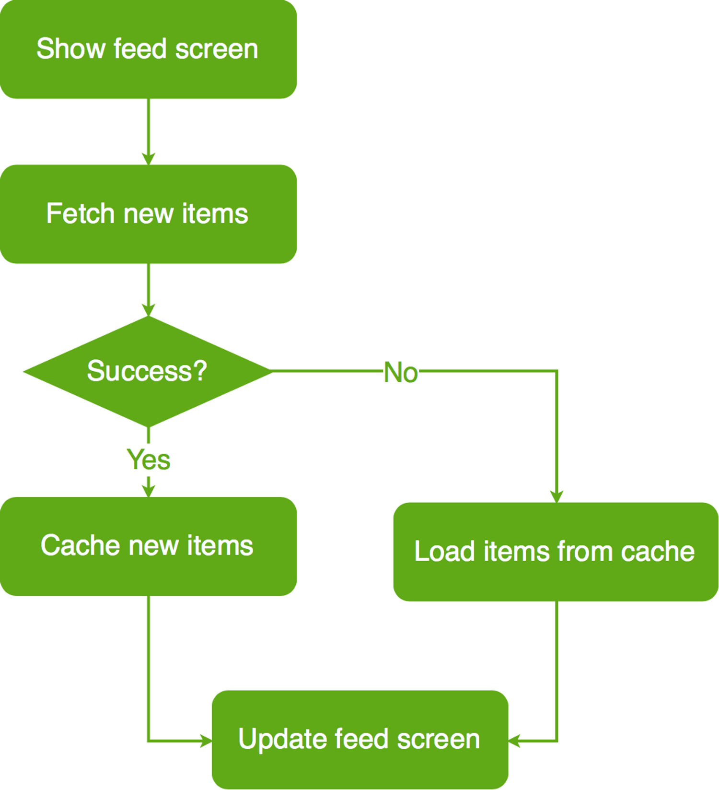
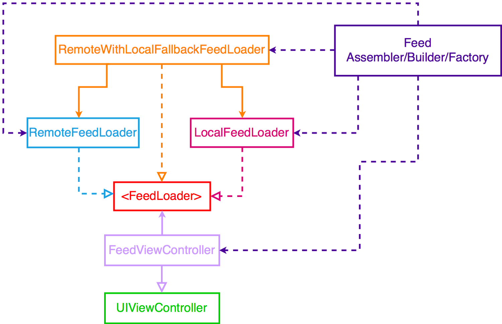

## Credits
All this project (code and resources) is not my creation.
I just put in practice the mentoring sessions of the [iOS Lead Essentials](https://iosacademy.essentialdeveloper.com/p/ios-lead-essentials/) curse, property of [Essential Developer](https://www.essentialdeveloper.com/)

# Image Feed Feature

[](https://travis-ci.com/Mentalex/EssentialFeed)

## BDD Specs

### Story: Customer requests to see the feed

### Narrative #1

```
As an online customer
I want the app to automatically load my latest image feed
So I can always enjoy the newest images of my friends
```

#### Scenarios (Acceptance criteria)

```
Given the customer has connectivity
 When the customer requests to see the feed
 Then the app should display the latest feed from remote
  And replace the cache with the new feed
```

### Narrative #2

```
As an offline customer
I want the app to show the latest saved version of my image feed
So I can always enjoy images of my friends
```

#### Scenarios (Acceptance criteria)

```
Given the customer doesn't have connectivity
 When the customer requests to see the feed
 Then the app should display the latest feed saved

Given the customer doesn't have connectivity
  And the cache is empty
 When the customer requests to see the feed
 Then the app should display an error message
```

## Use Cases

### Load Feed

#### Data:
- URL

#### Primary course (happy path):
1. Execute "Load Feed Items" command with above data.
2. System downloads data from the URL.
3. System validates downloaded data.
4. System creates feed items from valid data.
5. System delivers feed items.

#### Invalid data – error course (sad path):
1. System delivers error.

#### No connectivity – error course (sad path):
1. System delivers error.


### Load Feed From Fallback (Cache)

#### Data:
- Max age

#### Primary course:
1. Execute "Retrieve Feed Items" command with above data.
2. System fetches feed data from cache.
3. System creates feed items from cached data.
4. System delivers feed items.

#### No cache course (sad path):
1. System delivers no feed items.


### Save Feed Items

#### Data:
- Feed items

#### Primary course (happy path):
1. Execute "Save Feed Items" command with above data.
2. System encodes feed items.
3. System timestamps the new cache.
4. System replaces the cache with new data.
5. System delivers success message.

## Flowchart



## Architecture




## Model Specs

### Feed Image
| Property      | Type                |
|---------------|---------------------|
| `id`          | `UUID`              |
| `description` | `String` (optional) |
| `location`    | `String` (optional) |
| `url`	        | `URL`               |

### Payload contract

```
GET *url* (TBD)

200 RESPONSE

{
	"items": [
		{
			"id": "a UUID",
			"description": "a description",
			"location": "a location",
			"image": "https://a-image.url",
		},
		{
			"id": "another UUID",
			"description": "another description",
			"image": "https://another-image.url"
		},
		{
			"id": "even another UUID",
			"location": "even another location",
			"image": "https://even-another-image.url"
		},
		{
			"id": "yet another UUID",
			"image": "https://yet-another-image.url"
		}
		...
	]
}
```